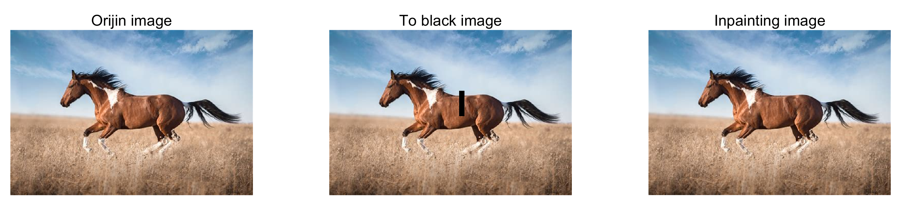

# 基于结构稀疏的图像修复算法
## 简介
图像修复(image inpainting)旨在对受到损害的图像采取恰当的方法恢复图像的原始状态。非数据驱动的图像修复算法将图像修复理解为利用图像完好区域对图像损坏区
域进行推断的过程，这里使用结构稀疏(structure sparsity)作为先验进行图像修复。

## 特点
基于结构稀疏的图像修复算法对于受损直线边界的修复有较好的表现，算法以patch为单位进行修复可以较完美地复原纹理(texture)和结构(structure)。但是对于非直
线边界，该方法是无能为力的；此外，如果直线边界过长且过程中存在光照、纹理的渐变，该方法并不能捕捉到该渐变，修复后可能会导致一定视觉上不自然。这时只能使
用数据驱动的修复算法，比如深度学习、字典学习等等。

## 效果

## 参考文献
[1] Jin D , Bai X . Patch-Sparsity-Based Image Inpainting Through a Facet Deduced Directional Derivative[J]. IEEE Transactions on Circuits
and Systems for Video Technology, 2019, 29(5):1310-1324.

[2] Z. Xu and J. Sun, “Image inpainting by patch propagation using patch sparsity,” IEEE Trans. Image Process., vol. 19, no. 5, pp. 1153–1165,
May 2010.

[3] A. Criminisi, P. Perez, and K. Toyama, “Region filling and object removal by exemplar-based image inpainting,” IEEE Trans. Image Process., 
vol. 13, no. 9, pp. 1200–1212, Sep. 2004. 
